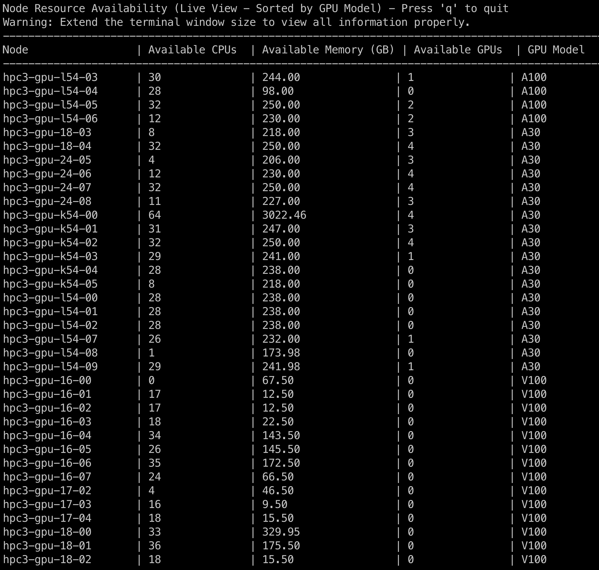

# Check GPU Nodes Resource Utilization
`curses_check_gpu.py` is a Python script designed to gather and display detailed resource utilization information (e.g., CPU, memory, and GPU) for nodes in an HPC cluster managed by Slurm. The script processes data from the `scontrol show node` command, aggregates the information, and saves it in a CSV file for easy analysis. Additionally, it provides a live, real-time display of the resource utilization directly in the terminal using the curses library.

---

## Features

- Retrieves detailed resource information for each node, including:
     - Total and allocated CPUs
     - Real and allocated memory (in GB)
     - GPU model, total GPUs, and allocated GPUs
- Outputs are directly displayed in the terminal, refreshed per 60 second.
- (Warning: Extend the terminal window size to view all information properly.)
- Outputs also result in a CSV file (`node_info.csv`).

---

## How to Run

1. **Clone the Repository**:
      ```bash
      git clone https://github.com/Oscarwasoccupied/HPC3_node_info.git
      cd HPC3_node_info
      ```

2. **Run the Script**:
      Execute the script directly from the command line:
      ```bash
      python curses_check_gpu.py
      ```

3. **Check the Output**:
      After running the script, you’ll have live updates (refreshed per 60 second) of Node, Available CPUs, Available Memory (GB), Available GPUs, and GPU Model on the terminal. Additionally, you will find the full nodes' information saved in a file named `node_info.csv` in the same directory. The table includes the following fields:
      - Node
      - Total CPUs, Allocated CPUs, Available CPUs
      - Real Memory (GB), Allocated Memory (GB), Available Memory (GB)
      - GPU Model, Total GPUs, Allocated GPUs, Available GPUs

4. **Press 'q' to quit**

---

## Example Output Image

Below is an example of what the live output in the terminal will be like:


Below is an example of what the saved CSV file will be like:


---

## Example Result

The output CSV file will look like this when viewed in a table format:

| Field                  | Description                              |
|------------------------|------------------------------------------|
| Node                   | Name of the node                         |
| Total CPUs             | Total number of CPUs available           |
| Allocated CPUs         | Number of CPUs currently in use          |
| Available CPUs         | Number of CPUs free for allocation       |
| Real Memory (GB)       | Total memory on the node in GB           |
| Allocated Memory (GB)  | Memory currently in use (GB)             |
| Available Memory (GB)  | Memory available for allocation (GB)     |
| GPU Model              | Model of GPU installed (e.g., V100)      |
| Total GPUs             | Total number of GPUs available           |
| Allocated GPUs         | Number of GPUs currently in use          |
| Available GPUs         | Number of GPUs free for allocation       |

---

## Notes

- The script assumes the nodes and GPU configurations are properly set up and accessible via `scontrol show node`.
- If some fields are missing in the `scontrol` output, default values (e.g., 0 for numerical fields and None for text fields) will be used to fill the gaps.

---