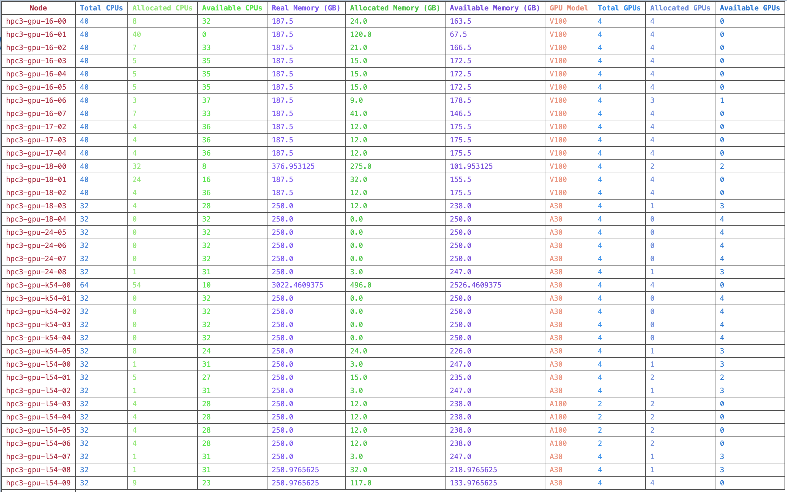

# Check GPU Resource Utilization

`check_gpu.py` is a Python script designed to gather and display detailed resource utilization information (e.g., CPU, memory, and GPU) for nodes in an HPC cluster managed by Slurm. The script processes data from the `scontrol show node` command, aggregates the information, and saves it in a CSV file for easy analysis.

---

## Features

- Retrieves detailed resource information for each node, including:
  - Total and allocated CPUs
  - Real and allocated memory (in GB)
  - GPU model, total GPUs, and allocated GPUs
- Handles missing fields by setting default values to ensure data consistency.
- Outputs results in a CSV file (`node_info.csv`).
- Displays completion status for each group of nodes during processing.

---

## How to Run

1. **Clone the Repository**:
   ```bash
   git clone https://github.com/Oscarwasoccupied/HPC3_node_info.git
   cd HPC3_node_info

2.	**Run the Script**:
Execute the script directly from the command line:
```bash
python check_gpu.py
```

3.	**Check the Output**:
After running the script, you’ll find the results saved in a file named node_info.csv in the same directory. The table includes the following fields:
	•	Node
	•	Total CPUs, Allocated CPUs, Available CPUs
	•	Real Memory (GB), Allocated Memory (GB), Available Memory (GB)
	•	GPU Model, Total GPUs, Allocated GPUs, Available GPUs
    ## Example Result

    The output CSV file will look like this when viewed in a table format:

    | Field                  | Description                              |
    |------------------------|------------------------------------------|
    | Node                   | Name of the node                         |
    | Total CPUs             | Total number of CPUs available           |
    | Allocated CPUs         | Number of CPUs currently in use          |
    | Available CPUs         | Number of CPUs free for allocation       |
    | Real Memory (GB)       | Total memory on the node in GB           |
    | Allocated Memory (GB)  | Memory currently in use (GB)             |
    | Available Memory (GB)  | Memory available for allocation (GB)     |
    | GPU Model              | Model of GPU installed (e.g., V100)      |
    | Total GPUs             | Total number of GPUs available           |
    | Allocated GPUs         | Number of GPUs currently in use          |
    | Available GPUs         | Number of GPUs free for allocation       |

## Notes

- The script assumes the nodes and GPU configurations are properly set up and accessible via `scontrol show node`.
- If some fields are missing in the `scontrol` output, default values (e.g., 0 for numerical fields and None for text fields) will be used to fill the gaps.

---

## Example Output Image

Below is an example of the output displayed in a table format:

